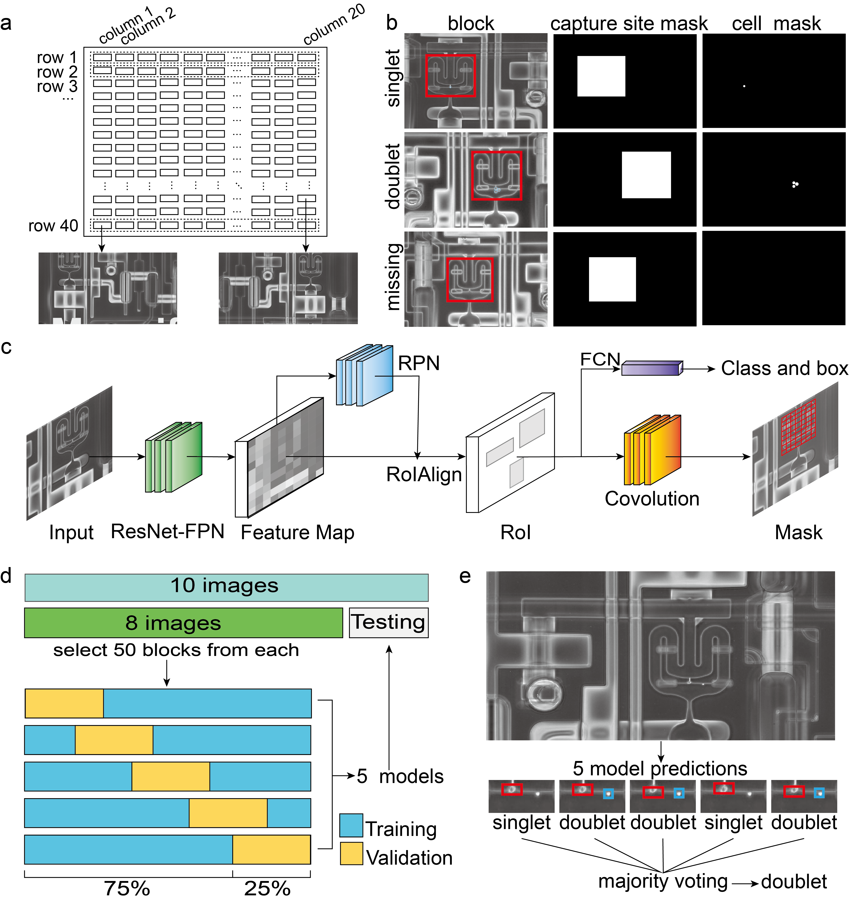

## Imaging complements genomics in Fluidigm doublet detection

Please contact (mqzhou@umich.edu or hyangl@umich.edu or gyuanfan@umich.edu) if you have any questions or suggestions.



---

## Installation
Git clone a copy of code:
```
git clone https://github.com/GuanLab/Image_based_doublet_detection.git
```

## Required dependencies
* [python](https://www.python.org) (3.6.5)
* [matplotlib](3.3.1)
* [h5py](2.10.0)
* [imgaug](0.4.0)
* [ipython](7.18.1)
* [keras](2.0.8)
* [scikit-image](0.17.2)
* [tensorflow-gpu](1.15.0)
* [R](https://www.r-project.org/)(3.6.1)
* [caret](https://cran.r-project.org/web/packages/caret/index.html)
* [e1071](https://cran.r-project.org/web/packages/e1071/index.html)
* [pROC](https://cran.r-project.org/web/packages/pROC/index.html)
* [stringr](https://cran.r-project.org/web/packages/stringr/index.html)
* [perl](https://www.perl.org/) (5.10.1)
* [kallisto](https://pachterlab.github.io/kallisto/)


## Dataset

* [images and transcript profiles](https://guanfiles.dcmb.med.umich.edu/image_based_doublet_detection/data/)
* [trained models](https://guanfiles.dcmb.med.umich.edu/image_based_doublet_detection/models/)

## Run prediction from saved model

```
bash example/run_prediction.sh
```

## Run example

```
bash example/run_example.sh
```

